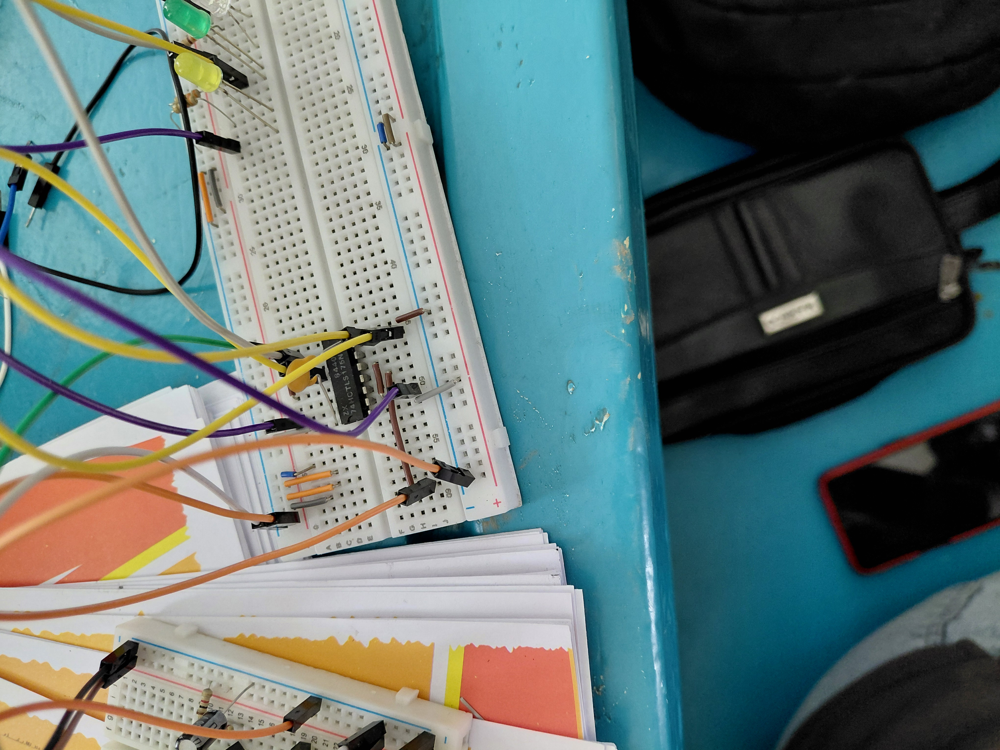

# Lab 4 — 4-Bit Shift Register (Serial Input)

> **Source:** Circuit demonstrated following educational content by [Ben Eater](https://www.youtube.com/playlist?list=PLowKtXNTBypGqImE405J2565dvjafglHU) and [Walid Issa](https://www.youtube.com/playlist?list=PLww54WQ2wa5obq6IbRbIiql8oHaTUp3T_). This repo documents the lab session — video and photos from the classroom demonstration.

## Objective
Chain four D flip-flops so data shifts one position per clock — serial input, parallel output.

## Theory
```
Serial IN → [FF1] → [FF2] → [FF3] → [FF4]
                Q0      Q1      Q2      Q3
```
4 clock pulses load a full 4-bit value serially.

## Circuit Photo


## Datasheet
[74HC_HCT175.pdf](../datasheets/74HC_HCT175.pdf)
